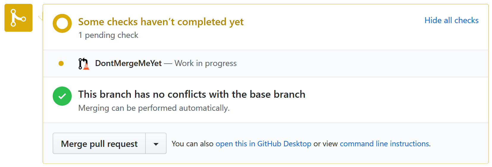
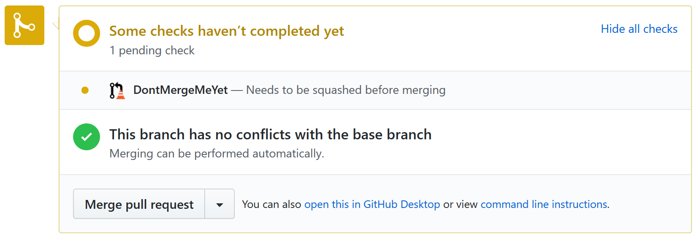
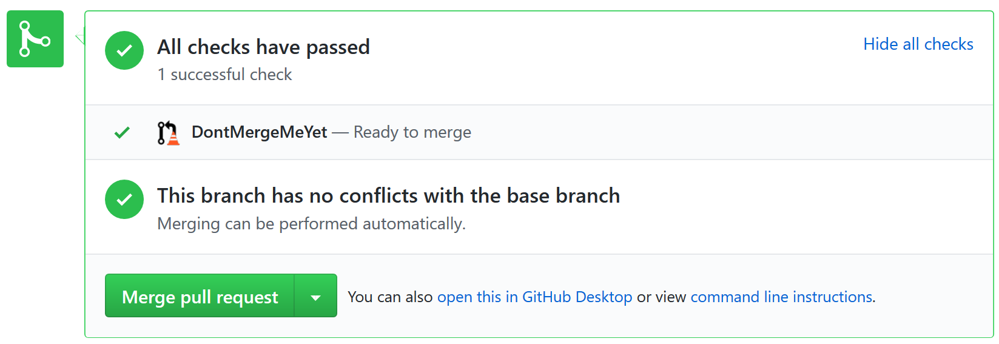

# DontMergeMeYet

A GitHub app that adds an "in progress" status to your pull requests to avoid merging them prematurely.

DontMergeMeYet marks the pull request as pending if one of these conditions is true:

- the PR title contains "WIP" or "DO NOT MERGE" (customizable)
- the PR has a `wip` or `in-progress` label (customizable)
- a commit message contains "contains "WIP" or "DO NOT MERGE" (customizable)
- a commit message starts with "fixup!" or "squash!", indicating the branch should be [autosquashed](http://fle.github.io/git-tip-keep-your-branch-clean-with-fixup-and-autosquash.html)

Otherwise, the pull request is marked as ready to merge.

## Screenshots

If a pull request contains "WIP" or "DO NOT MERGE" in its title or in a commit message, DontMergeMeYet shows the following status:



If a pull request has commits that need to be squashed (`fixup!` or `squash!` commits), DontMergeMeYet shows the following status:



Otherwise, DontMergeMeYet shows the following status:



## Installation

Head to the application's [public page](https://github.com/apps/dontmergemeyet), and install the app into one or more repos.

## Configuration

You can customize the WIP keywords and labels by creating a `dontmergemeyet.yml` file at the root of your repo:

```yaml
wipKeywords:
- text: DO NOT MERGE
  caseSensitive: false  # default is case insensitive
- text: WIP
  caseSensitive: true
wipLabels:
- wip
- in-progress
```

Note that these settings don't affect how fixup commits are detected ("fixup!" or "squash!" prefix).

DontMergeMeYet will always look for this file on the base branch of the pull request (i.e. the branch into which the PR will be merged).

## Privacy

DontMergeMeYet doesn't store any information on users or repositories. By using DontMergeMeYet, you grant it the following permissions:

❌ No access to code (except the `dontmergemeyet.yml` configuration file)  
✔️ Read access to metadata and pull requests  
✔️ Read and write access to commit statuses
